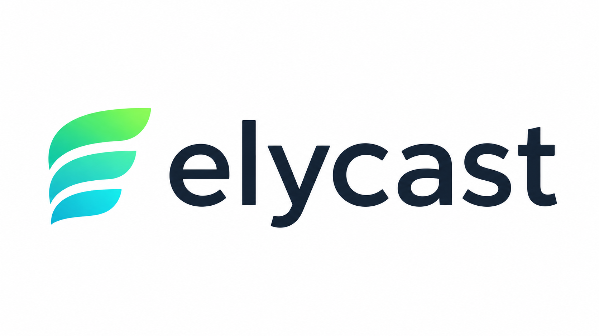

<p align="center">
  
</p>

<p align="center">
  <strong>La télé en direct, les films, les séries et vos fichiers personnels dans un seul lecteur Windows.</strong>
</p>

<p align="center">
  ElyCast se connecte à votre service IPTV ou à une playlist M3U, organise vos contenus et exploite votre GPU pour offrir une image plus nette, des mouvements plus fluides et un son personnalisable.
</p>

<p align="center">
  <a href="https://github.com/kudasaixc/elycast/actions/workflows/build.yml"></a>
  <a href="https://github.com/kudasaixc/elycast/actions/workflows/codeql.yml"></a>
  <a href="https://sonarcloud.io/summary/new_code?id=kudasaixc_elycast"></a>
  <a href="https://sonarcloud.io/summary/new_code?id=kudasaixc_elycast"></a>
  <a href="https://sonarcloud.io/summary/new_code?id=kudasaixc_elycast"></a>
</p>

<p align="center">
  
  
  
  <a href="LICENSE"></a>
  <a href="https://github.com/kudasaixc/elycast"></a>
</p>

---

## ElyCast 1.1

Cette version transforme ElyCast en lecteur multimédia adaptatif et consolide son architecture :

- **ELYSMART** détecte la machine, mesure les capacités réellement disponibles, recommande une configuration expliquée et surveille la santé du lecteur avec historique, diagnostic exportable et notifications non intrusives.
- **Onboarding intelligent** : le premier lancement inclut le profil d’usage, la détection matérielle, le benchmark ELYSMART, les recommandations de renderer et les tests de compatibilité.
- **Lecteur audio repensé** : visualiseur FFT temps réel, particules, palettes extraites de la pochette ou du fond, backgrounds animés, flou/assombrissement réglables, VSync et cibles jusqu’à 360 FPS. Avec ELYCORE, **AudioCore+** porte la même scène en D3D11 — mêmes barres, particules, ondes, couleurs et réglages — avec retour automatique au renderer WPF si le pipeline natif est indisponible.
- **Bibliothèques locales séparées** : import récursif de dossiers audio classés par artiste, album et genre grâce aux tags, playlists, file d’attente, shuffle/répétition et menu contextuel ; la vidéothèque reste volontairement simple et dédiée à la lecture.
- **Métadonnées Windows** : les fichiers audio locaux publient exclusivement leur titre, artiste, album et pochette intégrés dans les contrôles multimédias Windows. Les lives et vidéos ne créent aucune session audio système.
- **Identité ElyCast** : nouvel exécutable `ElyCast.exe`, icône officielle, AppUserModelID Windows et raccourci Shell cohérent.
- **Architecture maintenable** : MainWindow est découpée par domaines, ELYSMART et l’audio disposent de services dédiés, et les politiques de fin de lecture sont testées indépendamment.
- **Corrections de stabilité** : restauration correcte des catalogues après les paramètres, terminaison/reconnexion déterministes, visualiseur non bloquant et fallbacks préservés lorsque les runtimes optionnels sont absents.

## ElyCast, simplement

| Vous voulez… | ElyCast s’en charge |
| --- | --- |
| 🚀 **Démarrer sans rien régler** | Au premier lancement, un assistant détecte votre CPU/GPU, télécharge les dépendances (libmpv, shaders), teste RTX VSR et propose le moteur vidéo adapté à vos contenus. |
| 🧠 **Optimiser automatiquement ElyCast** | ELYSMART benchmarke la machine, explique ses recommandations et surveille les baisses durables de performances sans réagir aux pics ponctuels. |
| 📺 **Regarder votre IPTV** | Connectez un compte Xtream Codes ou une playlist M3U, puis retrouvez le direct par catégories. |
| 🎬 **Profiter des films et séries** | Parcourez la VOD, les saisons et les épisodes dans la même interface. |
| 💻 **Lire vos propres fichiers** | Importez séparément vos dossiers de musique et de vidéos ; l’audio est organisé par métadonnées avec playlists et file d’attente. |
| ✨ **Améliorer une image moyenne** | Activez RTX VSR, les shaders GPU ou Magpie pour gagner en netteté et en définition. |
| 🌊 **Rendre les mouvements plus fluides** | ELYFLOW peut créer des images intermédiaires avec NVIDIA Optical Flow. |
| 🎨 **Ajuster le rendu à votre goût** | ELYCOLOR permet de régler couleurs, contraste, gamma et traitements d’image. |
| 🔊 **Donner plus d’ampleur au son** | ELYSOUND+ applique un graphe libmpv stable : EQ en dB réels, dynamique douce, plafond anti-clipping et largeur stéréo pilotés à chaud sans seek ni rechargement. |
| 🎵 **Écouter de la musique avec un vrai visuel** | Le visualiseur réagit au spectre, aux basses et aux rythmes avec des particules animées, une palette liée à la pochette et des fonds personnalisables. Le renderer classique WPF et AudioCore+ D3D11 partagent exactement la même simulation et les mêmes réglages. |

Vous n’avez pas à choisir le moteur parfait avant chaque lecture : ElyCast sélectionne le backend demandé et bascule automatiquement vers une solution compatible si une technologie n’est pas disponible.

## Les trois expériences ElyCast

<table>
  <tr>
    <td width="33%" valign="top">
      <h3>🌊 ELYFLOW</h3>
      <p><strong>Plus fluide.</strong><br>Interpolation d’images NVIDIA FRUC, cadence adaptable et pipeline GPU conçu pour limiter les pertes d’images.</p>
    </td>
    <td width="33%" valign="top">
      <h3>🎨 ELYCOLOR</h3>
      <p><strong>Plus maîtrisé.</strong><br>Profils d’image, corrections colorimétriques et chaînes de shaders applicables pendant la lecture.</p>
    </td>
    <td width="33%" valign="top">
      <h3>🔊 ELYSOUND+</h3>
      <p><strong>Plus immersif.</strong><br>Égaliseur, préamplification, compresseur, limiteur, clarté et largeur stéréo configurables en direct.</p>
    </td>
  </tr>
</table>

## Ce qu’il sait lire

- Télévision en direct via Xtream Codes ou M3U
- Films, séries, saisons, épisodes et EPG
- Vidéothèque locale avec import récursif de dossiers et lecture via mpv ou VLC
- Bibliothèque musicale : MP3, FLAC, WAV, AAC, M4A, OGG, Opus, WMA, ALAC, AIFF et APE, tri par artiste/album/genre, playlists, shuffle, répétition et file d’attente
- Pistes audio multiples et sous-titres sélectionnables
- Favoris, reprise de lecture, catégories et recherche
- Contrôles multimédias Windows pour l’audio local avec titre, artiste, album et pochette

> ElyCast ne fournit aucun abonnement, chaîne ou contenu. Vous devez utiliser un service et des médias auxquels vous êtes autorisé à accéder.

## Une chaîne vidéo pensée pour le GPU

ELYCORE est le renderer natif haute performance d’ElyCast :

```text
libmpv
  → rendu OpenGL
  → texture D3D11 partagée sans lecture CPU
  → RTX Video Super Resolution (optionnel)
  → NVIDIA FRUC / ELYFLOW (optionnel)
  → présentation DXGI dans le player
```

Pour l’audio local, ELYCORE peut remplacer la surface de visualisation WPF par AudioCore+ : l’analyse FFT et la simulation restent communes, puis les primitives résolues sont rasterisées en D3D11 tandis que la pochette, les anneaux et les métadonnées conservent leur composition WPF. FRUC est automatiquement contourné pendant cette scène audio.

| Backend | Fonctionnement | Idéal pour |
| --- | --- | --- |
| **ELYCORE** | libmpv + OpenGL/D3D11 + VSR/FRUC + DXGI | Le meilleur pipeline NVIDIA disponible |
| **RTX SDK** | mpv `gpu-next` + traitement vidéo D3D11 NVIDIA | Profiter de RTX VSR sans ELYCORE |
| **mpv GPU** | mpv `gpu-next`, décodage matériel et scalers avancés | La lecture GPU générale |
| **VLC** | Décodage LibVLC vers une surface WPF | Le fallback de compatibilité |

## Prérequis

### Pour utiliser l’application

- Windows 10 ou Windows 11 en 64 bits
- 7-Zip pour l’installation de libmpv depuis ElyCast
- Un GPU compatible avec le backend choisi
- Un GPU NVIDIA RTX et un pilote récent pour RTX VSR et ELYFLOW/FRUC

### Pour compiler le projet

- [.NET 8 SDK](https://dotnet.microsoft.com/download/dotnet/8.0)
- Visual Studio avec **Desktop development with C++** et CMake
- NVIDIA Optical Flow SDK 5.0.7 et le runtime NvOFFRUC pour compiler FRUC

Le SDK NVIDIA et ses DLL propriétaires ne sont volontairement pas distribués dans ce dépôt.

## Compiler ElyCast

Le composant natif doit être compilé avant l’application WPF :

```powershell
cmake -S native/ElyFlow.Native -B native/ElyFlow.Native/build -A x64
cmake --build native/ElyFlow.Native/build --config Release
dotnet restore "ElyCast TV Player.csproj"
dotnet build "ElyCast TV Player.csproj" -c Release -p:Platform=x64
```

Ou utilisez le script prévu à cet effet :

```powershell
powershell -NoProfile -ExecutionPolicy Bypass -File .\scripts\build.ps1 -Configuration Release
```

Sans le SDK NVIDIA, ELYCORE se compile et fonctionne, mais son adaptateur FRUC reste indisponible. Pour activer FRUC, placez le SDK de façon à obtenir ce chemin avant la configuration CMake :

```text
native/NVIDIA-Optical-Flow-SDK-5.0.7/
  Optical_Flow_SDK_5.0.7/NvOFFRUC/Interface/NvOFFRUC.h
```

Les outils téléchargés par l’application — libmpv, shaders et Magpie — sont installés dans `%APPDATA%\ElyCast\tools`, jamais dans le dépôt.

## Architecture du dépôt

```text
App.xaml(.cs)                 Démarrage, ressources et styles globaux
MainWindow.xaml               Shell visuel principal et surfaces du player
MainWindow.*.cs               Coordination par domaine : catalogue, playback, settings, OSD et fonctions ELY
Models/                       Réglages, profils et modèles multimédias
Services/Audio/               Métadonnées, analyse FFT et contrôle ELYSOUND+
Services/ElySmart/            Benchmark, scoring, recommandations et supervision runtime
Services/                     IPTV, état, thème, console et services Windows
Services/Video/               Backends mpv/VLC, HWND, shaders et interop natif
native/ElyFlow.Native/        Renderer ELYCORE C++20 et adaptateur NVIDIA FRUC
Assets/                       Ressources visuelles de l’application
docs/images/                  Images utilisées par la documentation
scripts/                      Commandes de build reproductibles
tests/                        Régressions audio/playback et probe RTX VSR
AGENTS.md                     Carte technique complète et invariants du projet
```

La documentation technique détaillée se trouve dans [`AGENTS.md`](AGENTS.md). Elle décrit les flux de lecture, les responsabilités de chaque fichier, le threading, l’airspace WPF/Win32, le renderer natif et les règles de modification sûres.

## Qualité et sécurité

- Compilation Windows x64 contrôlée à chaque push et pull request
- Analyse statique CodeQL sur le code C# et C++
- Quality Gate, sécurité et maintenabilité suivies sur [SonarQube Cloud](https://sonarcloud.io/summary/new_code?id=kudasaixc_elycast)
- Profils et état local protégés avec Windows DPAPI
- Écritures de configuration atomiques
- Aucun SDK propriétaire, média, playlist, profil ou binaire versionné
- Les logs évitent volontairement les URL de lecture complètes, car elles peuvent contenir des identifiants

## Données locales et confidentialité

Les profils, favoris, réglages et éléments de bibliothèque restent sous `%APPDATA%\ElyCast`. Les profils et l’état sérialisé sont protégés par Windows DPAPI pour l’utilisateur courant.

Le `.gitignore` exclut les playlists M3U, médias, journaux, secrets, certificats, SDK NVIDIA, outils téléchargés et sorties de compilation.

## Contribuer

1. Lisez [`AGENTS.md`](AGENTS.md) avant une modification importante.
2. Conservez les fallbacks lorsque mpv, NVIDIA, FRUC, les shaders ou Magpie sont absents.
3. Compilez le renderer natif puis l’application en Release x64.
4. Pour le renderer ou l’interface du player, testez également le redimensionnement, le plein écran, le HUD et les changements de focus.
5. Ne publiez jamais d’identifiants IPTV ou d’URL de flux complètes.

## Licence

ElyCast est distribué sous [Mozilla Public License 2.0](LICENSE). Les bibliothèques, SDK et runtimes tiers restent soumis à leurs licences respectives.

<p align="center">
  <strong>ElyCast — vos contenus, votre matériel, votre expérience.</strong>
</p>
